# PCMLAI-capstone

### CyberSecurity ground truth prediction

In the evolving cybersecurity landscape, the increase in threat actors has overwhelmed enterprise security operation centers (SOCs) with incidents. This situation necessitates solutions for classifying the threat and triggering a remediation process. However, fully automated systems require a very high confidence threshold to avoid errors due to automated actions, making them often impractical. As a result, building guided response (GR) systems that aid SOC analysts in making informed decisions. These guided response systems require a triaged threat assessment that is then prioritized and fed for further review and action by a SOC analyst.

### Objective

The primary objective of the exercise is to accurately predict incident triage grades as true positive (TP), benign positive (BP), and false positive (FP)—based on labeled responses from SOCs of customers. 

Considering that businesses that rely on 24x7 connectivity, a business impact due to mis-handling of alerts/incidents (either ignored, or bring down services in response to ones that did not need it) could be huge. As such high precision and a high recall is desired on the predicted for TruePositive and False Positive classifications

### Data

The original data set comprises of 13 million pieces of evidence across 33 entity types, covering 1.6 million alerts and 1 million annotated incidents with triage labels from customers over a two-week period. The dataset is built from telemetry from 6100 organizations, using 9100 unique detectors. All data was anonymized. The data is available on Kaggle at https://www.kaggle.com/datasets/Microsoft/microsoft-security-incident-prediction

More information on how this data was prepared, how alerts were corelated into incidents can be found in this whitepaper: https://arxiv.org/abs/2407.09017. The scope of this initiative was much larger - to corelate events, triage prediction and remediation action prediction. The focus of this analysis is alert level triage prediction only. It does not make any specific inferences aggregated at the IncidentLevel. Also considering the compute restrictions on a personal laptop this analysis is restricted to 150K train / 150K test samples selected at random. Both train/test data sets were stratified to have an equal distribution across BP, FP and TP classes. 

### Jupyter Notebook

https://github.com/mgk2014/PCMLAI-capstone/blob/main/xdr.ipynb

### Data Cleaning and Feature Engineering

The following steps were taken to clean the data and engineer new features:

- Choose random sample of equal number of BP, TP and FP samples (50k each) for both train and test data sets, from a 500k sample of the train and test data set. The original distribution is about BP(43%), TP(35%), FP(22%). The stratified data set helped improve the Precision and Recall scores
- Ignored the extra usage feature in the test dataset that was not found in the training (more information is needed to clarify the role of this feature)
- Deleted the features that had more than 90% values missing: ResourceType, ThreatFamily, EmailClusterId, Roles, AntispamDirection
- ActionGrouped, ActionGranular are related to action recommendations post the initial triage. Since this analysis is restricted to triage, these features were dropped
- Timestamp was converted to Timestamp data type. This feature was not immediately use in the analysis, but may be used for forecasting of alerts
- MitreTechniques feature was abstracted to the high leave Mitre such as T1078 (account access), ignoring the sub MitreTechniques (ex: T1078.001, T1078.002) recorded in the alerts. Sub Mitres may be included in further analysis if Mitre is found to be an important feature in the analsys
- Geo Features such as Country, State were removed in favor of  City feature since City represented by anonymous code 10630 represeted > 99% of the data 

### Exploratory Data Analysis

Majority of alerts are observed during the Initial Access phase of an attach (46%). Exfiltration category as marked by the detectors appear to have the lowest true positive incident grades

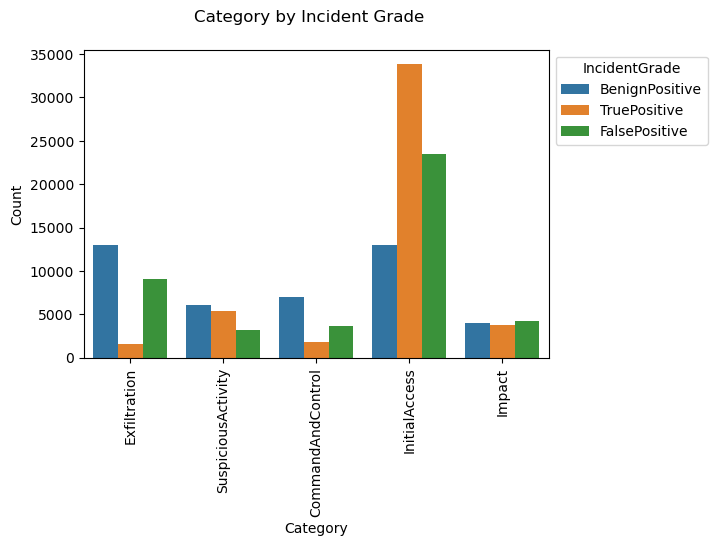

The LastVerdict column was populated only in 20% of all alerts. There were quite a few False and Benign Positives that were finally tagged as Suspicious or Malicious.

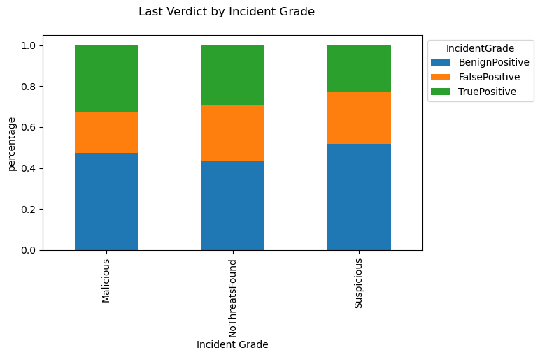

"DetectorId 0" typically refers to a generic or default detection mechanism, meaning it signifies an alert triggered by a broad security
rule that isn't specifically tied to a particular security feature. Quite a few alerts were tagged to Detector 0, perhaps suggesting exploration of more specifical rules for future alerts

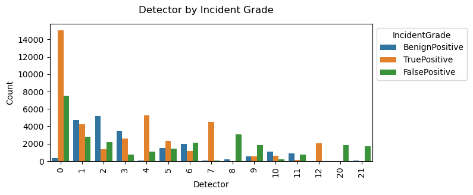

T1566 (Phishing) and T1078 (valid accounts) MitreTechniques were the most common techniques discovered by the detectors

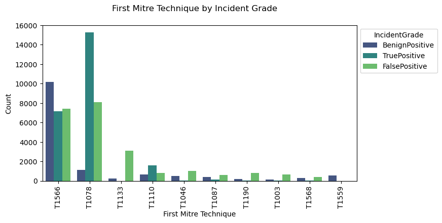

Majority of evidence for alerts are related to IP and user information

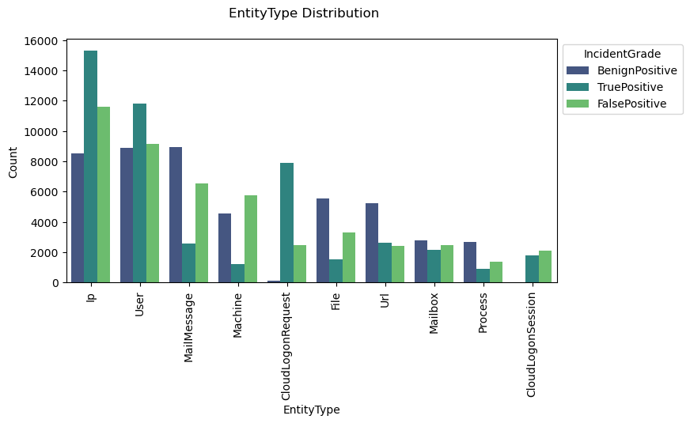

All numerical features in this dataset represent discrete values. As such correlation/heatmaps plots were not considered useful. 

### Model development

- Ran 4 classifiers with default parameters. Macro Precision, Recall, and F1 scores were used (since this is multiclass) and are recorded in this table
    
    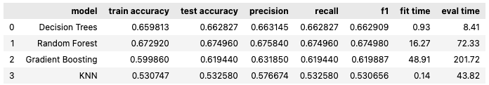

    The classification reports, confusion matrices, and ROC-AUC are included in the linked Jupyter Notebook

- DecisionTree and RandomForestClassifier registered the highest macro F1 scores. The DecisionTree classifier was the fastest to fit and evaluate. However the default DecisionTree fitted to a depth of 86 indicating over fitting

- Leveraged GridSearchCV to find optimal hyper parameters on DecisionTree and RandomForest classifiers. Random Forest classifier results are shown below (DT results are in the Jupyter notebook)

#### Random Forest Classifier

- Following parameters were used to further train RandomForest model. This resulted in fitting of 250 models
    
    rf_grid_params = {'n_estimators': [50, 100, 150, 300], 'min_samples_split': [0.1, 0.01, 0.001],'oob_score': [True, False]'max_features': ['sqrt', 'log2'],

- Best parameters returned by GridSearch Cross Validation:

    {'max_features': 'sqrt','min_samples_split': 0.001, 'n_estimators': 50,'oob_score': True}

- Classification report

    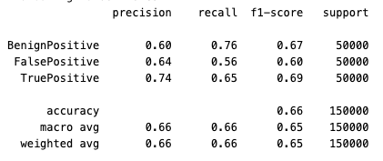

- Confusion Matrix

    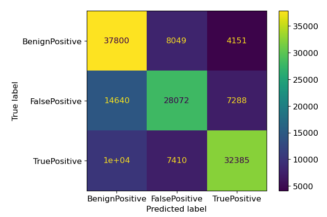

- ROC/AUC curve

    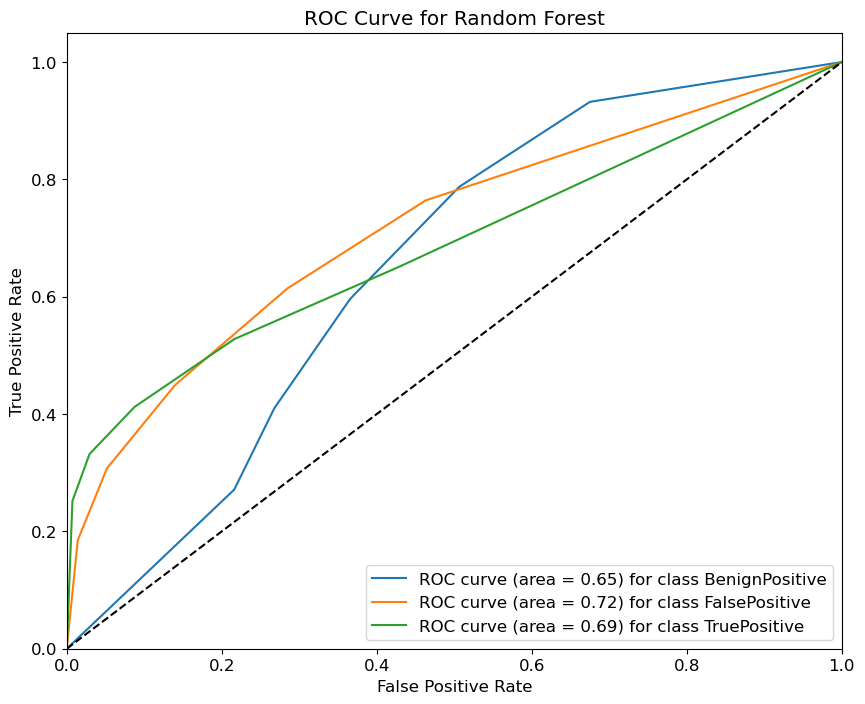

- Top contributing features

    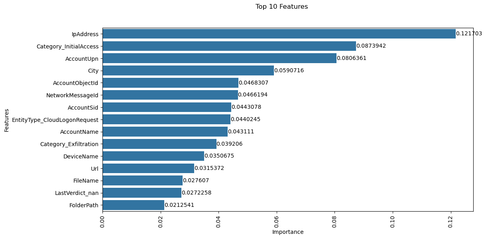

- Further exploration was done with Randomized Search CV (50 models) and restriction the model to top contributing features. The final Macro F1 scores of these experiments were very similar to results shared here. The details are in the linked Jupyter notebook.

- To help understand the contribution of various features to a single prediction, 'treeinterpreter' and 'waterfall' libraries were used. Here it predicts TP for a single alert by producing three different scores for BP, FP and TP [[0.34563431 0.07359429 0.5807714 ]], thus predicting the majority class

    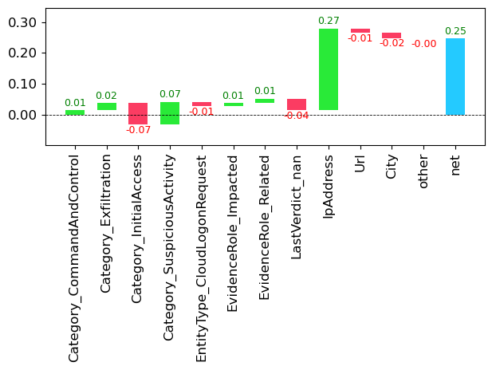

### Conclusion

SOCs demand very high F1 scores before an action further can be undertaken by automation or human intervention. The goal is to catch as many real events (requiring high precision), and not miss any real attack (high recall i.e. reduce false negatives). 

The macro F1 scores of 69% for True Positives (TP), and 60% for False Positives (FP) would not be considered high in SOC environments. Further more the top 10 contributing features, do not explain more than 50% of the target variable prediction. 

Futher work is needed to achieve higher F1 scores before it may be considered for deployment in a SOC and perhaps identifying additional features that may help make a better fitting model.

### Next steps

- Investigage the data acquisition pipeline, and explore whether any additional features could have been included in the data set
- Exploring engineering additional features from the available set of features
- Increase the size of data set used in the evaluation
- Further fine tune the hyper paremeters for the Random Forest
- Explore other models, such as AdaBoost or DeepLearning techniques
