# PCMLAI-capstone

### Alert and Incident Grade prediction in Extended Detection and Response (XDR) solutions

In the evolving cybersecurity landscape, the increase in threat actors has overwhelmed enterprise security operation centers (SOCs) with incidents. This situation necessitates solutions for immediately classifying alerts and incidents handled in XDR solutions and triggering an appropriate remediation process. However, fully automated systems require a very high confidence threshold to avoid errors due to automated actions, making them often impractical. As a result, SOCs consider building guided response (GR) systems that aid analysts in making informed decisions. These guided response systems require a triaged threat assessment that is then prioritized and fed for further review and action by a SOC analyst.

### Objective

The primary objective of the exercise is to accurately predict alert and incident triage grades as true positive (TP), benign positive (BP), and false positive (FP) — leveraging labeled responses from SOCs of existing customers. 

Considering that businesses that rely on 24x7 connectivity, a business impact due to mis-handling of alerts/incidents (either ignored, or bring down services in response to ones that did not need it) could be huge. As such high precision and a high recall is desired on the TP, FP and BP classifications.

### Data

The original data set comprises of 13 million pieces of evidence across 33 entity types, covering 1.6 million alerts and 1 million annotated incidents with triage labels from customers over a two-week period. The dataset is built from telemetry from 6100 organizations, using 9100 unique detectors. All data was anonymized. The data is available on Kaggle at https://www.kaggle.com/datasets/Microsoft/microsoft-security-incident-prediction

More information on how this data was prepared, how alerts were corelated into incidents, can be found in this whitepaper: https://arxiv.org/abs/2407.09017. The scope of the initiative was much larger - to co-relate events, predict triage grades, predict a remediation action and suggest similar incidents. The focus of my analysis is alert level triage prediction only. It does not make any specific inferences aggregated at the Incident level. Also considering the compute restrictions on a personal laptop this analysis is restricted to 150K train / 150K test samples selected at random. Both train/test data sets were stratified to have an equal distribution across BP, FP and TP classes. 

### Jupyter Notebook

The jupyter notebook used in the analysis is here:
https://github.com/mgk2014/PCMLAI-CAPSTONE2/blob/main/xdr.ipynb

### Data Cleaning and Feature Engineering

The following steps were taken to clean the data and engineer new features:

- Chose random sample of equal number of TP, FP and BP samples (50k each) for both train and test data sets, from a 500k random sample of the original train and test data set. The original distribution is about TP(35%), FP(22%), BP(43%).  The stratified data set helped improve the Precision and Recall scores.
- Ignored the extra usage feature in the test dataset that was not found in the training (more information is needed to clarify the role of this feature)
- Deleted the features that had more than 90% values missing: ResourceType, ThreatFamily, EmailClusterId, Roles, AntispamDirection
- ActionGrouped, ActionGranular are related to action recommendations post the initial triage. Since this analysis is restricted to triage, these features were dropped
- Timestamp was converted to Timestamp data type. This feature was not immediately used in the analysis, but may be used for forecasting of alerts
- MitreTechniques feature was abstracted to the high leave Mitre such as T1078 (account access), ignoring the sub MitreTechniques (ex: T1078.001, T1078.002) recorded in the alerts. SubMitre techniques may be included in further analysis if Mitre is found to be an important feature in the analsys
- Geo Features such as Country, State were removed in favor of  City feature since City represented by anonymous code 10630 represeted > 99% of the data

### Exploratory Data Analysis

Majority of alerts are observed during the Initial Access phase of an attach (46%). Exfiltration category as marked by the detectors appear to have the lowest true positive incident grades

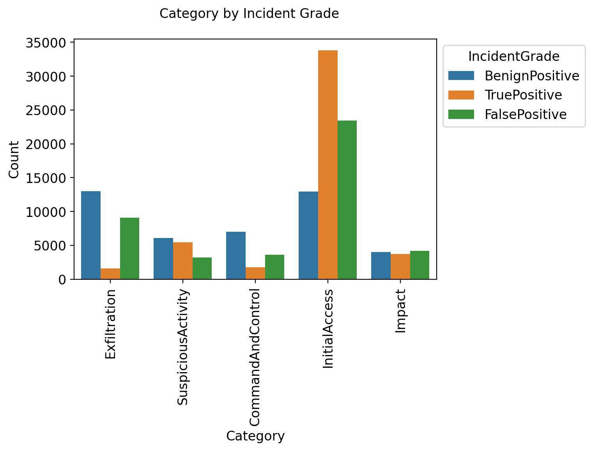

The LastVerdict column was populated only in 20% of all alerts. There were quite a few False and Benign Positives that were finally tagged as Suspicious or Malicious.

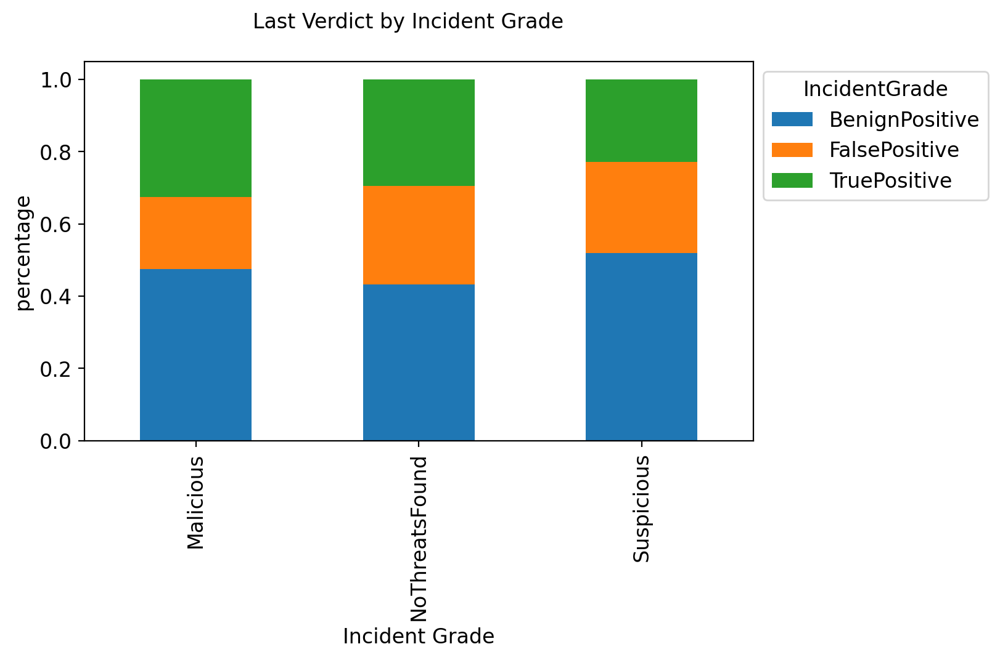

"DetectorId 0" typically refers to a generic or default detection mechanism, meaning it signifies an alert triggered by a broad security
rule that isn't specifically tied to a particular security feature. Quite a few alerts were tagged to Detector 0, perhaps suggesting exploration of more specifical rules for future alerts

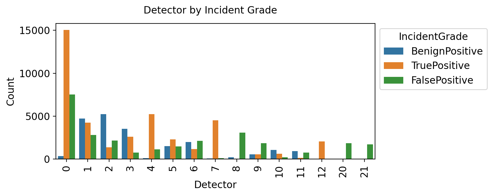

T1566 (Phishing) and T1078 (valid accounts) MitreTechniques were the most common techniques discovered by the detectors

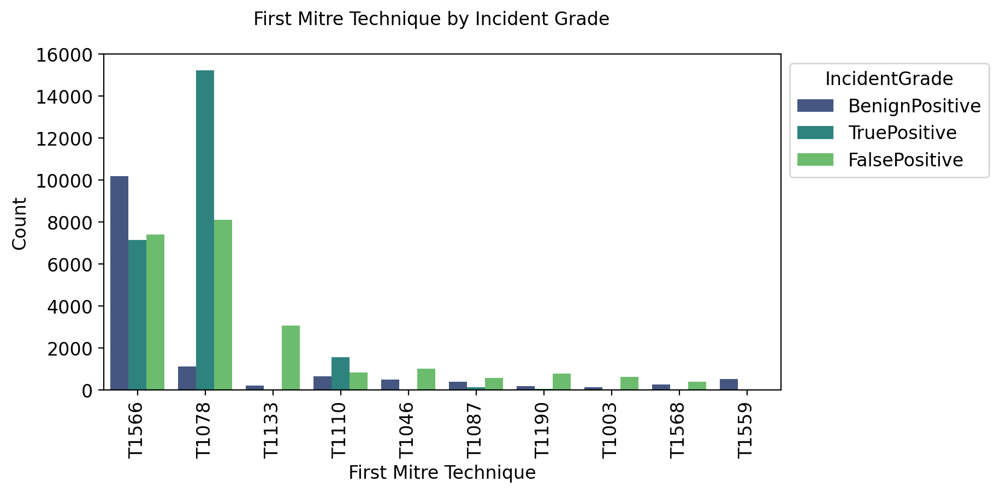

Majority of are related to IP and user entities

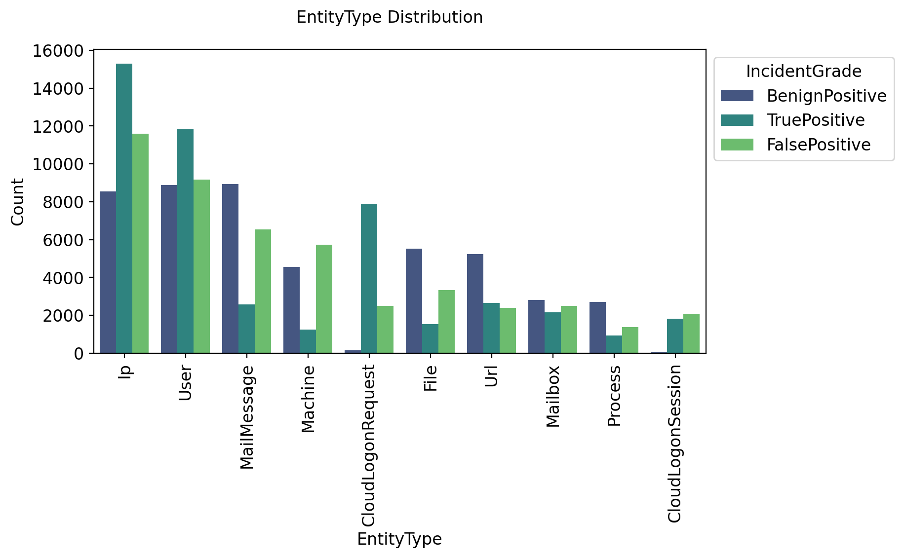

All numerical features in this dataset represent discrete values. Some of the features appear to be highly correlated for ex: AccountsId, AccountsName, AccountObjectId, AccountUps. Except AccountsId, other co-related features removed before developing the model

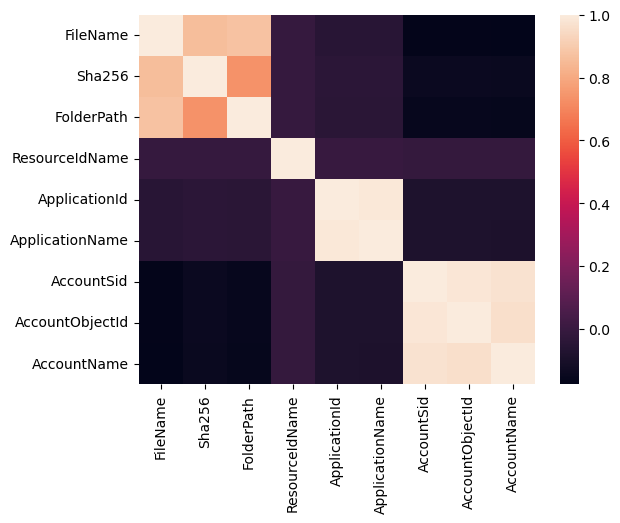

### Model development - multi-class classification

- Ran Logistic Regression (LR), KNN, DecisionTree (DT), Support Vector Machine (SVM), Random Forest (RF) and GradientBoosting (GB) classifiers with default parameters. LR and SVM executed on smaller data sets (10k rows) but took a long time (> 9-10 hrs) with the 150K train dataset size chosen for this analysis. With the smaller data sets, SVM, LR did not improve upon the scores of the RF classifier. Subsquently, SVM, RF classifiers were removed in the final analysis.

- KNN, DT, RF and Gradient Boosting classifers with default parameters - Macro Precision, Recall, and F1 scores are recorded in this table
    
    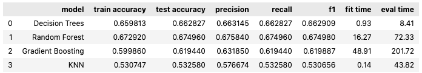

    The classification reports, confusion matrices, and ROC-AUC are included in the linked Jupyter Notebook

- DecisionTree and RandomForestClassifier registered the highest macro F1 scores. The DecisionTree classifier was the fastest to fit and evaluate, however indicated an over fitting with a tree depth of 86

- Leveraged GridSearchCV to find optimal hyper parameters on DecisionTree and RandomForest classifiers. RF classifier grid search results results are shown below (DT results are in the linked Jupyter notebook)

#### Random Forest Classifier

- The following parameters were used to further train RandomForest model. This resulted in fitting of 270 models
    
    rf_grid_params = {'n_estimators': [100, 200, 300],'max_depth': [30, 50, 75],'min_samples_split': [5, 10, 15],'class_weight': ['balanced', None]}

- Best parameters returned by GridSearch Cross Validation:

    {'class_weight': 'balanced','max_depth': 30,'min_samples_split': 5,'n_estimators': 200}

- Classification report

    Indicates F1 scores of TP - 71%, FP - 64%, BP - 68%

    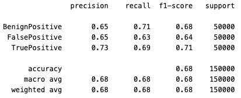

- Confusion Matrix

    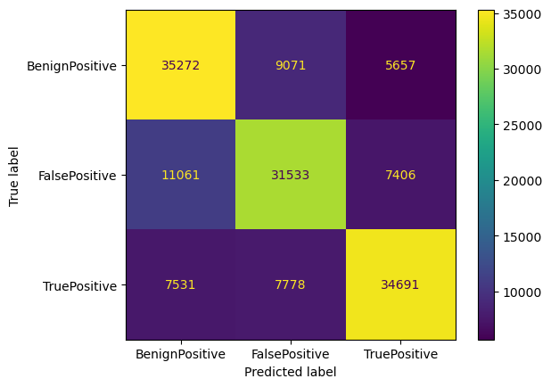

- ROC/AUC curve

    The model's predictions cover an AUC i.e area under curve of 70% for TP, 73% for FP. Ideally these curves should be cover a larger area expanding towards the top left of the chart

    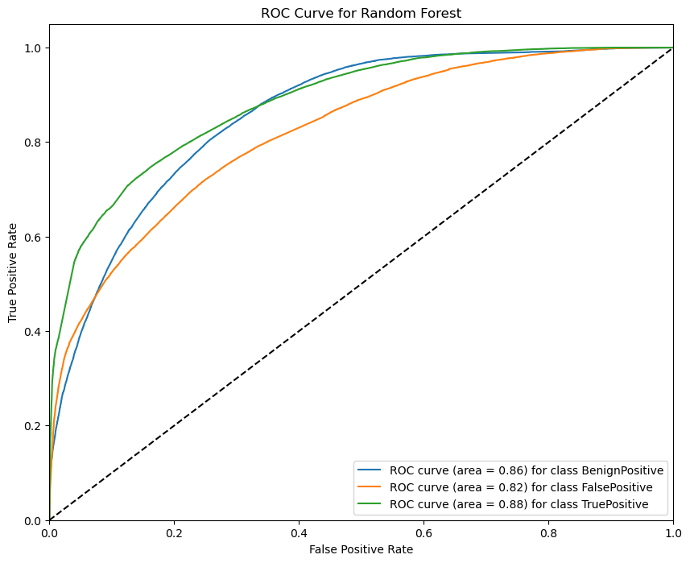

- Top contributing features

    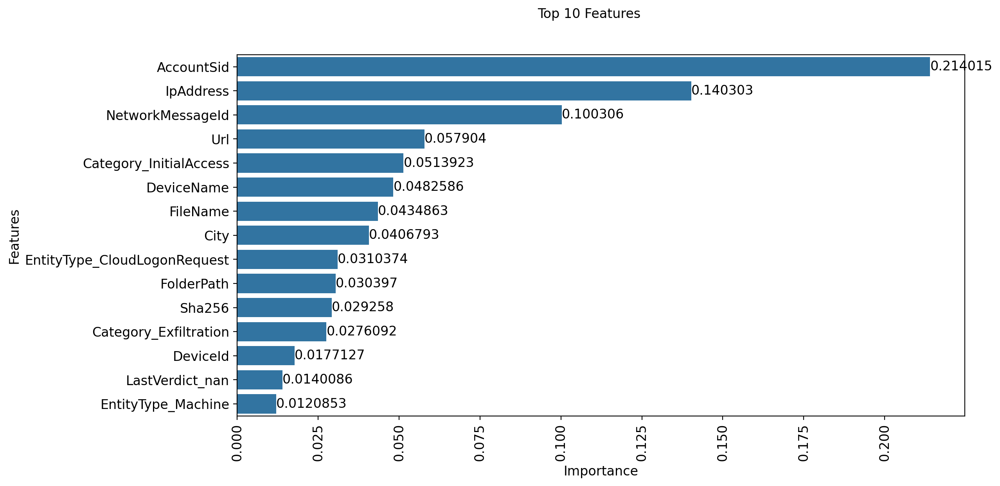

- Further exploration was done with Randomized Search CV (50 models) and a new model with top 10 contributing features. The final Macro F1 scores of these experiments were very similar to results shared here. The details are in the linked Jupyter notebook.

- To help understand the contribution of various features to a single prediction, 'waterfall' library were used. Here it predicts TP for a single alert by producing three different probability scores for BP, FP and TP [[0.10477976 0.42804762 0.46717262]] respectively, thus predicting the majority class i.e. True Positive

    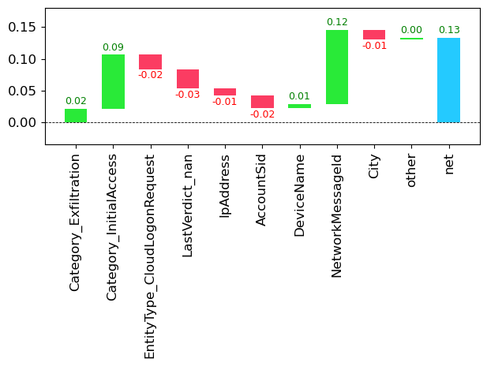

### Conclusion

SOCs demand very high F1 scores before an action may be undertaken by automation or humans. The goal is to catch as many real events (requiring high precision), and not miss any real attacks (high recall i.e. reduce false negatives). The macro F1 scores of 71% for True Positives (TP), 64% for False Positives (FP), 68% for Benign Positives (BP) would not be considered high in SOC environments, and may require a further triage before actions may be taken.

The model considers account information, ip address, network message Id, Url, and device name as top contributing features i.e. the features that have the most impact on determining whether an alert should be marked as TP, FP or BP. While this is intuitive based on past labeled data, it complicates the deployment of the model as introduction of new devices or services in the network would require periodic revisions (re-fitting) to the model. Additional discussions are needed with an SME to understand the processes within a SOC around user/device life-cycle & introduction of new services.

Additional feature exploration in data acquisition pipeline, feature engineering work, and model development/tuning is needed to achieve higher F1 (>90%) scores before it may be considered for deployment in a SOC environment.

### Next steps

- Investigate the data acquisition pipeline, and explore whether any additional features could be included in the data set
- Explore engineering additional features from the available set of features
- Explore sequential model building - convert the 3 classes into a binary classification problem (TP and Not TP) and evaluate if that improves results for TP. If it does, a 2nd model can be built that predicts for FP vs BP.
- Increase the size of data set used in the evaluation to capture more variation and perhaps increase the feature contribution to the target variable
- Further fine tune the hyper paremeters for the Random Forest
- Explore other classification models, such as AdaBoost, and dive back into Support Vector Machines and Logistic Regression using better compute resources
